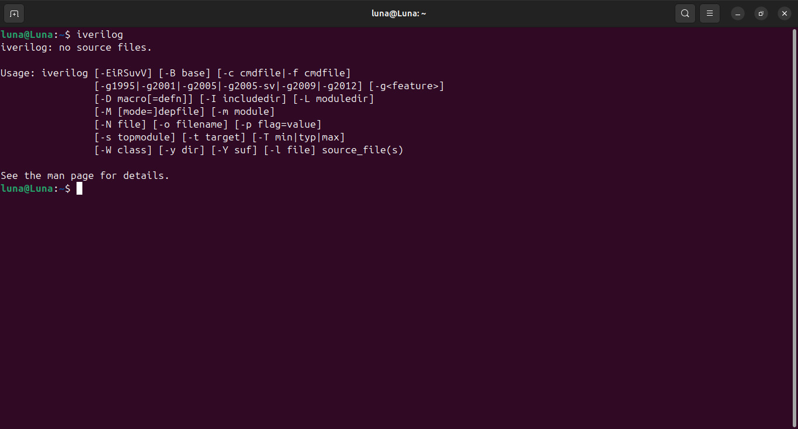
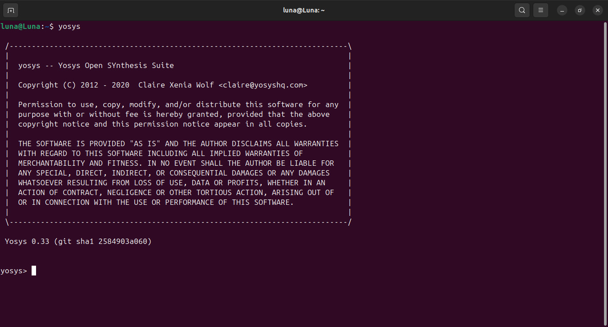
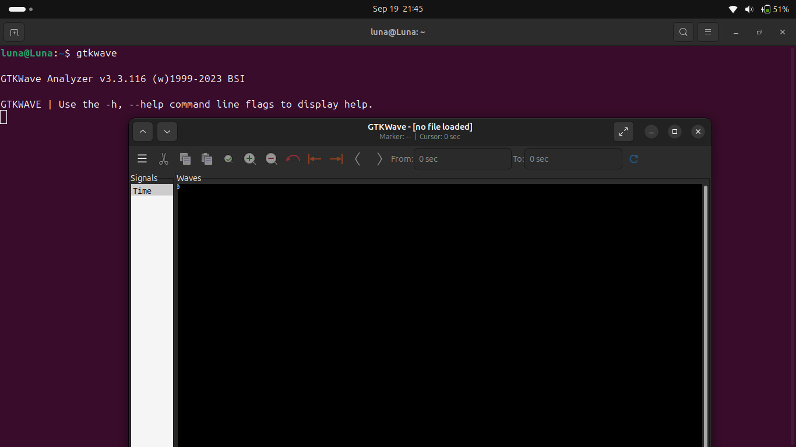

## 📅 Week 0: Environment Setup & Toolchain Installation

Welcome to the detailed log for Week 0. The primary objective of this foundational week was to set up a robust development environment by installing and verifying the complete open-source Electronic Design Automation (EDA) toolchain. This setup is critical for the entire RTL-to-GDSII design flow.

### ✅ Task 0: EDA Tool Installation
This task involved installing the core software required for Verilog simulation, synthesis, and waveform viewing.

### 1. Icarus Verilog (iverilog)
Icarus Verilog is a Verilog simulation and synthesis tool. It's used to compile the hardware description language (HDL) code and run testbenches to verify the design's functionality.

- #### Installation Command:
```bash
sudo apt-get update
sudo apt-get install iverilog
```

- #### Verification:
To confirm a successful installation, I checked the installed version from the terminal.
```bash
iverilog -V
```
The command correctly returned the version number, confirming the installation.




### 2. Yosys Open SYnthesis Suite
Yosys is a framework for Verilog RTL synthesis. It's a crucial tool that transforms the human-readable Verilog code into a gate-level netlist, which is a representation of the circuit using standard logic gates.

- #### Installation Command:
```bash
$ sudo apt-get update
$ git clone https://github.com/YosysHQ/yosys.git
$ cd yosys
$ sudo apt install make (If make is not installed please install it)
$ sudo apt-get install build-essential clang bison flex \
 libreadline-dev gawk tcl-dev libffi-dev git \
 graphviz xdot pkg-config python3 libboost-system-dev \
 libboost-python-dev libboost-filesystem-dev zlib1g-dev
$ make config-gcc
$ make
$ sudo make install 
```
- #### Verification:
I verified the Yosys installation by checking its version.
```bash
yosys --version
```
The output displayed the version information, indicating that Yosys is ready for use.



### 3. GTKWave Waveform Viewer
GTKWave is a fully featured GTK+ based wave viewer. After running a simulation, GTKWave is used to visualize the output waveforms (.vcd files), allowing for in-depth analysis and debugging of the digital circuit's behavior over time.

- #### Installation Command:
```bash
sudo apt-get install gtkwave
```
- #### Verification:
I confirmed the installation by launching the graphical user interface from the command line.
```bash
gtkwave
```
