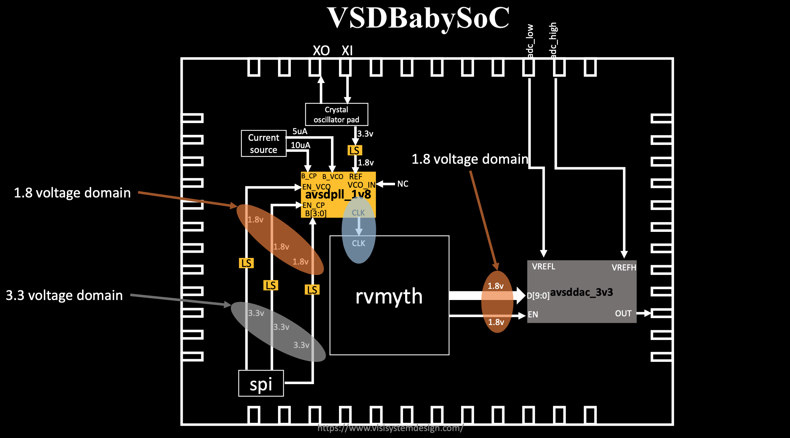
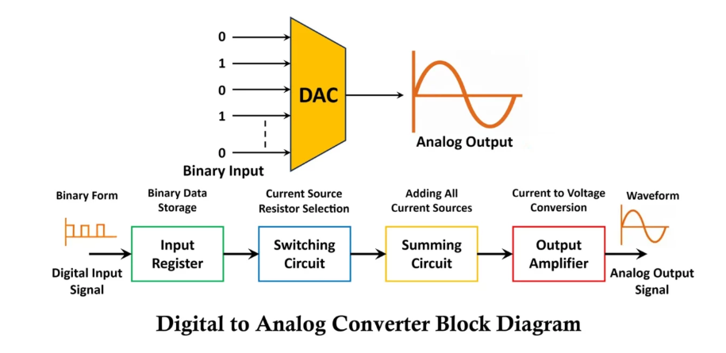

# My VSDBabySoC Simulation Journey 🚀

This repository documents the process of simulating a miniature System-on-Chip (SoC), the **VSDBabySoC**. The primary goal is to understand the end-to-end flow of a digital design, from high-level code to hardware simulation, and to observe how a RISC-V CPU core can control an analog output.

-----
## VSDBabySoC Physical Design Flow
In integrated circuit design, physical design is a step in the standard design cycle which follows after the circuit design. At this step, circuit representations of the components (devices and interconnects) of the design are converted into geometric representations of shapes which, when manufactured in the corresponding layers of materials, will ensure the required functioning of the components.


## 🏛️ VSDBabySoC Architecture

The VSDBabySoC is a simple yet powerful educational tool that integrates three essential components on a single chip.


1.  🧠 **RVMYTH Core:** A minimal RISC-V processor that executes a hardcoded program. Its primary job is to perform calculations and write the results to a specific register (`r17`) which is connected to the outside world.

2.  ⏱️ **Phase-Locked Loop - PLL:** This analog block takes an external clock signal and generates a stable, clean internal clock that synchronizes the operations of the entire chip.


3.  🎚️ **Digital-to-Analog Converter - DAC:** This component bridges the digital and analog worlds. It reads the 10-bit digital value from the CPU's `r17` register and converts it into a corresponding analog voltage level.


**The core concept** is to demonstrate a complete data path: instructions stored in the CPU's memory cause it to generate changing digital values, which the DAC then translates into a real-world analog waveform.

-----

## 💻 The Simulation Workflow

This project involves setting up the environment, preparing the source code, running a simulation, and analyzing the resulting waveforms.

### Step 1: Environment Setup

First, clone the repository and ensure you have the necessary open-source EDA tools installed.

```bash
# Clone the project repository
git clone https://github.com/manili/VSDBabySoC.git
cd Project_VSDBabySoC/

# Install required tools (Icarus Verilog for simulation, GTKWave for viewing)
sudo apt-get update
sudo apt-get install iverilog gtkwave
```

### Step 2: Convert TL-Verilog to Verilog

The RVMYTH CPU core is written in TL-Verilog, a higher-level abstraction of Verilog. We must first convert it to standard Verilog (`.v`) using the `sandpiper-saas` tool so that simulators like Icarus Verilog can understand it.

```bash
# It's recommended to use a Python virtual environment
python3 -m venv myenv
source myenv/bin/activate

# Install the Sandpiper tool
pip install sandpiper-saas

# Run the conversion
sandpiper-saas -i ./src/module/*.tlv -o rvmyth.v --outdir ./src/module/
```

This command finds all `.tlv` files and outputs a standard `rvmyth.v` file in the same directory.

### Step 3: Run the Pre-Synthesis Simulation

With all source files in Verilog format, we can now compile and run the simulation using `iverilog`.

```bash
# Create a directory for simulation outputs
mkdir -p output

# Compile the Verilog source files and the testbench
iverilog -o output/simulation.out src/module/testbench.v

# Run the compiled simulation binary
vvp output/simulation.out
```

This process will generate a `simulation.vcd` file, which contains the waveform data.

-----

## 📊 Results and Analysis

The final step is to visualize and understand the simulation output using GTKWave.

```bash
gtkwave output/simulation.vcd
```
**Initial Waveform View - Digital Signals:**

<p align="center">
   
</p>

*Key signals displayed: **CLK** (stable clock from PLL), **reset** (system initialization), **RV_TO_DAC[9:0]** (10-bit RVMYTH output), and **OUT** (DAC output in digital view).*

---

**Analog Waveform Visualization:**

To properly view the DAC's analog output behavior, we change the display format:
1. Select the **OUT** signal
2. Right-click → Data Format → Analog → Step

<p align="center">
   
</p>

*Configuring GTKWave to display the DAC OUT signal in analog step format for realistic visualization.*

---

**Final Analog Waveform:**

<p align="center">
   
</p>

*DAC output displayed as analog waveform showing the staircase conversion of digital values from RVMYTH's register r17 into analog voltage levels. The stepping behavior clearly demonstrates the 10-bit quantization of the digital-to-analog conversion process.*

### Interpreting the Waveform

Inside GTKWave, you should add the key signals to the wave panel, especially `CLK`, `reset`, and **`RV_TO_DAC[9:0]`**. The `RV_TO_DAC` signal represents the 10-bit value in register `r17` that is being sent to the DAC. You will observe this value change over time according to the program logic.

The program hardcoded into the RVMYTH core executes in three main phases:

1.  **Ramp-Up:** A loop adds incrementing numbers, causing the `RV_TO_DAC` value to steadily increase, creating a ramp.
2.  **Oscillation:** A second loop repeatedly adds and subtracts values, causing the `RV_TO_DAC` value to oscillate around a central point.
3.  **Halt:** The CPU enters an infinite loop, holding the final value steady.

### From Digital Value to Analog Voltage

The DAC converts the 10-bit integer value from the CPU into an analog voltage. The output voltage ($V_{OUT}$) can be calculated with the following formula, assuming a reference voltage span ($V_{REF\_SPAN}$) of 1.0V:

$$V_{OUT} = \frac{\text{Digital Value (from r17)}}{2^{10} - 1} \times V_{REF\_SPAN} = \frac{\text{RV\_TO\_DAC}}{1023} \times 1.0V$$

For example, when the program reaches its peak digital value of **946**:

$$V_{OUT} = \frac{946}{1023} \times 1.0V \approx 0.925V$$

This calculation confirms the direct relationship between the software running on the CPU and the physical analog voltage generated by the SoC.

-----

## 💡 Key Takeaways

  * **Software Drives Hardware:** This project clearly shows how a sequence of instructions (software) directly controls the behavior of physical hardware components.
  * **Digital-Analog Interface:** The DAC is a critical component in mixed-signal SoCs, allowing the digital processing core to interact with the real, analog world.
  * **Open-Source EDA:** The entire simulation was performed using freely available, open-source tools like Icarus Verilog, GTKWave, and SandPiper.

## 🔮 Future Enhancements

The current design uses a fixed, hardcoded program. A future goal is to implement a memory loading mechanism, allowing the CPU to execute programs written in C or Assembly that are loaded from an external source, making the SoC a truly programmable platform.